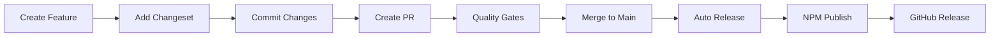

# 📦 AgenticFlow Package Publishing Guide

## 🎯 Overview

The AgenticFlow monorepo uses a sophisticated publishing pipeline that combines **Changesets** for version management with **automated CI/CD** for safe, reliable package releases to NPM.

## 🏗️ Architecture

### Publishing Components

```
Publishing Pipeline
├── 📋 Changesets           # Version management & changelog
├── 🤖 GitHub Actions       # Automated CI/CD releases
├── 🔍 Quality Gates        # Pre-release validation
├── 📦 Package Validation   # NPM publishing checks
└── 🚀 Multi-Release Types  # Auto, snapshot, prerelease, graduate
```

### Release Types

| Type | Description | When to Use | NPM Tag |
|------|-------------|-------------|---------|
| **Auto** | Standard production release | Merging to main | `latest` |
| **Snapshot** | Development preview | Feature testing | `snapshot` |
| **Prerelease** | Alpha/beta versions | Pre-production testing | `alpha` |
| **Graduate** | Promote prerelease to stable | Moving alpha to stable | `latest` |

## 🚀 Quick Start

### 1. Creating a Changeset

```bash
# Create a changeset describing your changes
pnpm changeset

# Follow the interactive prompts:
# 1. Select packages to bump
# 2. Choose version bump type (patch/minor/major)
# 3. Write summary of changes
```

### 2. Publishing Releases

```bash
# Dry run - see what would be published
node scripts/publish.js --dry-run

# Auto release (production)
node scripts/publish.js

# Snapshot release (development)
node scripts/publish.js --type snapshot

# Prerelease (alpha/beta)
node scripts/publish.js --type prerelease

# Graduate prerelease to stable
node scripts/publish.js --type graduate
```

## 📋 Changeset Workflow

### Creating Changesets

```bash
# Standard workflow
pnpm changeset add
# or
pnpm changeset

# Changeset files are created in .changeset/
# Commit these files with your changes
git add .changeset/
git commit -m "feat: add new feature"
```

### Example Changeset

```markdown
---
"@agenticflow/core": minor
"@agenticflow/nodes": patch
---

Add support for async node execution and improve error handling in the core execution engine.
```

### Changeset Types

- **Major**: Breaking changes (1.0.0 → 2.0.0)
- **Minor**: New features, backward compatible (1.0.0 → 1.1.0)  
- **Patch**: Bug fixes, backward compatible (1.0.0 → 1.0.1)

## 🤖 Automated Publishing (GitHub Actions)

### Triggers

- **Main Branch Push**: Auto production release
- **Pull Request Merge**: Auto production release
- **Manual Workflow**: Any release type

### Workflow Configuration

The `.github/workflows/release.yml` handles:

1. ✅ Quality gate validation
2. 🏗️ Package building
3. 🔍 Changeset detection
4. 📦 NPM publishing
5. 📝 GitHub release creation

### Required Secrets

Configure these in GitHub repository settings:

```bash
# Required for NPM publishing
NPM_TOKEN=npm_xxxxxxxxxxxxxxxx

# Required for GitHub releases (auto-generated)
GITHUB_TOKEN=ghp_xxxxxxxxxxxxxxxx
```

## 🔍 Quality Gates Integration

Publishing pipeline enforces quality standards:

```bash
# Pre-publishing checks
✅ Linting passes
✅ TypeScript compilation
✅ All tests pass
✅ Build successful
✅ No security vulnerabilities
✅ Package validation
```

### Quality Gate Levels

| Gate Type | Checks | Use Case |
|-----------|--------|----------|
| **Pre-commit** | Lint, format, basic tests | Development |
| **Pre-push** | + TypeScript, unit tests | Code review |
| **Pull Request** | + Integration tests, coverage | CI validation |
| **Release** | + Security audit, performance | Production release |

## 📦 Package Configuration

### Required package.json Fields

```json
{
  "name": "@agenticflow/package-name",
  "version": "0.1.0",
  "description": "Package description",
  "main": "dist/index.js",
  "types": "dist/index.d.ts",
  "exports": {
    ".": {
      "types": "./dist/index.d.ts",
      "import": "./dist/index.js",
      "require": "./dist/index.js"
    }
  },
  "files": ["dist", "README.md", "CHANGELOG.md"],
  "scripts": {
    "build": "tsc -p tsconfig.build.json",
    "prepublishOnly": "pnpm build && pnpm test"
  },
  "publishConfig": {
    "access": "public",
    "registry": "https://registry.npmjs.org/"
  },
  "repository": {
    "type": "git",
    "url": "https://github.com/agenticflow/agenticflow",
    "directory": "packages/package-name"
  }
}
```

## 🚀 Release Process

### Standard Release Workflow



### Manual Release Process

1. **Prepare Release**
   ```bash
   # Check current status
   pnpm changeset status
   
   # Preview what will be released
   node scripts/publish.js --dry-run --verbose
   ```

2. **Execute Release**
   ```bash
   # Set NPM token (if not in environment)
   export NODE_AUTH_TOKEN=npm_xxxxxxxxxxxxxxxx
   
   # Run release
   node scripts/publish.js
   ```

3. **Verify Release**
   ```bash
   # Check published packages
   npm view @agenticflow/core
   
   # Verify GitHub release created
   # Check GitHub releases page
   ```

## 🔧 Advanced Configuration

### Custom Publishing Script Options

```bash
# Full options
node scripts/publish.js \
  --type auto \
  --dry-run \
  --verbose

# Environment variables
NODE_AUTH_TOKEN=npm_xxx \
GITHUB_TOKEN=ghp_xxx \
node scripts/publish.js
```

### Changeset Configuration

`.changeset/config.json`:

```json
{
  "changelog": ["@changesets/changelog-github", {
    "repo": "agenticflow/agenticflow"
  }],
  "access": "public",
  "baseBranch": "main",
  "updateInternalDependencies": "patch",
  "ignore": [
    "@agenticflow/eslint-config",
    "@agenticflow/prettier-config"
  ]
}
```

## 🐛 Troubleshooting

### Common Issues

#### 1. Publishing Fails - Missing NPM Token
```bash
Error: Missing required environment variables: NODE_AUTH_TOKEN

# Solution: Set NPM token
export NODE_AUTH_TOKEN=npm_xxxxxxxxxxxxxxxx
```

#### 2. Quality Gates Fail
```bash
Error: Quality gates failed for release

# Solution: Fix issues before publishing
pnpm lint
pnpm typecheck
pnpm test
```

#### 3. No Changesets Found
```bash
Warning: No changesets found - nothing to publish

# Solution: Create changeset for your changes
pnpm changeset add
```

#### 4. Package Build Missing
```bash
Error: Package @agenticflow/core missing dist directory

# Solution: Build packages first
pnpm build
```

### Debug Publishing Issues

```bash
# Verbose dry run to see exact steps
node scripts/publish.js --dry-run --verbose

# Check changeset status
pnpm changeset status --verbose

# Validate quality gates manually
pnpm quality:gates:release

# Test individual package builds
cd packages/core && pnpm build
```

## 📊 Monitoring & Analytics

### Release Metrics

The publishing pipeline tracks:

- ⏱️ Release frequency
- 📦 Package download counts
- 🐛 Post-release issue rates
- 🔄 Rollback frequency
- ⚡ Publishing pipeline duration

### Release Reports

Generated reports include:

```json
{
  "timestamp": "2025-06-01T18:52:00.000Z",
  "releaseType": "auto",
  "packages": ["@agenticflow/core", "@agenticflow/nodes"],
  "environment": {
    "node": "v20.15.0",
    "npm": "10.8.0",
    "pnpm": "10.2.1"
  }
}
```

## 🔒 Security & Best Practices

### Security Checklist

- ✅ NPM 2FA enabled
- ✅ Repository secrets secured
- ✅ Dependency vulnerability scanning
- ✅ Package provenance enabled
- ✅ Code signing (future)

### Publishing Best Practices

1. **Always use changesets** for version management
2. **Run dry-run first** to preview changes
3. **Fix quality gates** before publishing
4. **Test packages locally** after installation
5. **Monitor post-release** for issues
6. **Use semantic versioning** correctly
7. **Write clear changelogs** for users

## 📚 Additional Resources

- [Changesets Documentation](https://github.com/changesets/changesets)
- [NPM Publishing Guide](https://docs.npmjs.com/packages-and-modules/contributing-packages-to-the-registry)
- [Semantic Versioning](https://semver.org/)
- [GitHub Actions Workflow Syntax](https://docs.github.com/en/actions/using-workflows/workflow-syntax-for-github-actions)

---

**🎉 Happy Publishing!** The AgenticFlow publishing pipeline is designed to be safe, reliable, and developer-friendly. Questions? Check the troubleshooting section or reach out to the team! 